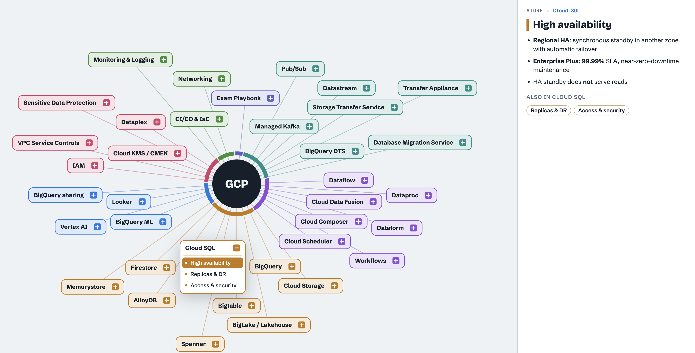

# PDE Exam Atlas

An interactive mind map for studying for the **Google Cloud Professional Data Engineer** certification.

**👉 Open it here: https://petitbonney.github.io/GCP-Professional-Data-Engineer-Exam-Atlas/**

[](https://petitbonney.github.io/GCP-Professional-Data-Engineer-Exam-Atlas/)

## What it is

The atlas lays out the Google Cloud services that come up on the exam as one zoomable map. Each service is a card you can open to see its key concepts, written as short exam-focused bullets. An **Exam Playbook** card collects cross-service decision patterns, such as which storage or processing service fits a given requirement.

Services are grouped into domains: Design playbook, Ingest & migrate, Process & orchestrate, Store, Analyze & ML, Govern & secure, and Operate. Each service is also tagged with the official exam sections it covers:

| # | Exam section | Weight |
|---|---|---|
| 1 | Design data processing systems | 22% |
| 2 | Ingest & process data | 25% |
| 3 | Store data | 20% |
| 4 | Prepare & use data for analysis | 15% |
| 5 | Maintain & automate workloads | 18% |

## Using it

- **Click a service** to open its concepts. Use **↑ / ↓** to move through a list.
- **Drag** to pan and **scroll** to zoom, or use the **− / Fit / +** buttons.
- **Expand all / Collapse all** opens or closes every card.
- **Click an exam section** in the top strip, or a group in the legend, to highlight the related services.
- **Search** finds services and concepts by name.
- **Hover an acronym** (CMEK, CDC, DAG…) to see what it stands for.

## Running locally

It's a static site with no build step and no dependencies. Open `index.html` in a browser, or serve the folder:

```sh
python3 -m http.server 8000
# then open http://localhost:8000
```

## Project layout

```
index.html           page shell; loads the scripts below in order
src/css/styles.css   all styles
src/data/meta.js     exam sections (with weights) and service domains
src/data/services.js services, their exam sections, and concept bullets
src/data/acronyms.js acronym → expansion, used for hover tooltips
src/js/              tree building, measuring, layout, rendering, pan/zoom,
                     side panel, search, filters, tooltips, boot
```

## Editing the content

Most edits only touch `src/data/`:

- **Add or edit a service** in `src/data/services.js`. Each entry is
  `[id, label, domain, examSections, serviceBullets, [[concept, bullets], ...]]`.
  Wrap text in `**double asterisks**` to make it bold.
- **Add an acronym** to `src/data/acronyms.js` and it will get a tooltip wherever it appears.

## Disclaimer

This is an unofficial study aid and isn't affiliated with or endorsed by Google. The content was checked against the exam guide in October 2026. Always confirm details against the [official exam guide](https://cloud.google.com/learn/certification/data-engineer) and the Google Cloud documentation.
